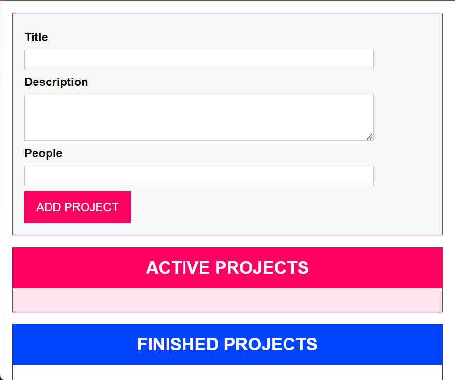

# Project Manager

Created a robust Project Management System in TypeScript using an object-oriented approach, allowing users to efficiently manage project details and track their status (active or finished).


Create reports and charts to visualize project progress and statistics.
This TypeScript project, developed in an object-oriented manner, will allow users to efficiently manage project details and track their status, providing a valuable tool for project managers and teams.


## Authors

- [@Pratham](https://github.com/Pratham16112002)


## Installation

clone the project

```bash
  cd Project-Manager
  index.html
```
    
## Badges

Add badges from somewhere like: [shields.io](https://shields.io/)

[](https://choosealicense.com/licenses/mit/)


## Screenshots




## Features

-  Define a Project class that encapsulates project details such as name, description, start date, end date, and status.
Use TypeScript's class features to provide strong typing and maintainability.

- Develop a user-friendly interface that allows users to interact with the system.
- Show a list of all projects created, including their details and status.
- Include options for editing and marking the project as active or finished from the detail view.
- Ensure that the project management system is accessible and usable on various devices, including desktops, tablets, and smartphones.

